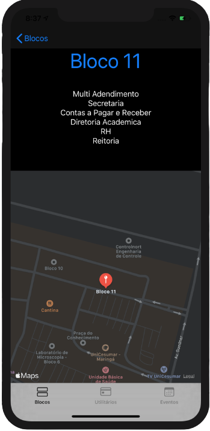

# HUBUnicesumar

Projeto final desenvolvido durante o curso presencial "Práticas de Cloud Services usando Swift com ênfase em IoT" do Hackatruck MakerSpace.

## Sobre o HackTruck MakerSpace
O HackaTruck MakerSpace é um projeto de capacitação profissional de estudantes de Instituições de Ensino Superior de Tecnologia da Informação, em desenvolvimento iOS para aplicativos móveis com aplicação em Internet das Coisas (IoT).

Como um projeto dinâmico e itinerante numa verdadeira capacitação sobre rodas, o HackaTruck  MakerSpace vem inspirado pelo conceito maker com seu laboratório móvel constituído como um makerspace, um espaço onde os alunos criam e desenvolvem protótipos relacionados aos temas estudados.

O projeto é patrocinado pela IBM Brasil e Flex, em colaboração com a Apple, e executado pelo Instituto de Pesquisas Eldorado.

## Sobre o projeto
O objetivo do projeto foi criar um aplicativo mobile para IOS utilizando as tecnologias e os conhecimentos adquiridos durante curso.

## Sobre o aplicativo desenvolvido
O aplicativo HUBUnicesumar tem como principal objetivo ajudar novos alunos da Universidade de ensino Superior Unicesumar a se localizarem e ficarem por dentro de tudo o que acontece no campus.

### Funcionalidades e Telas
  1. A principal funcionalidade do app é ajudar os alunos a localizarem um bloco dentro do Campus, ao selecionar um bloco o aplicativo usa a localização mesmo e abre um mapa com uma marcação nele, e também mostra a localização em tempo real do usuário.
  

 

  2. A segunda funcionalidade é uma lista de utilitários espalhados pelo campus como farmácia, banco, cantinas, ao clicar no utilitário de seu interesse, temos um menu dropdown que mostra as informações desejadas como localidade e horário de funcionamento.
  

  
  3. A terceira funcionalidade consiste em uma tela com os eventos que estão ocorrendo no campus, onde ao clicar, o usuário será direcionado para a página oficial da universidade com todas as informações sobre o evento de escolha.
  

## Tecnologias utilizadas e conceitos aprendidos

### Linguagem de programação Swift
Swift é uma linguagem para desenvolvimento no IOS, macOS, watchOS, tvOS e Linux.
Ela foi utilizada para o desenvolvimento do aplicativo.

### Cloudant
O cloudant é um serviço de banco de dados baseado em nuvem da IBM.
Ele foi utilizado para persistência e recuperação dos dados.

### Node-RED
Node-RED é uma ferramenta de desenvolvimento baseada em fluxo para programação visual desenvolvida originalmente pela IBM.
Utilizado para criação do endpoint usado para a conexão entre o aplicativo e o Cloudant.

# License
The MIT License (MIT)

Copyright ©️ 2022 - HUBUnicesumar
